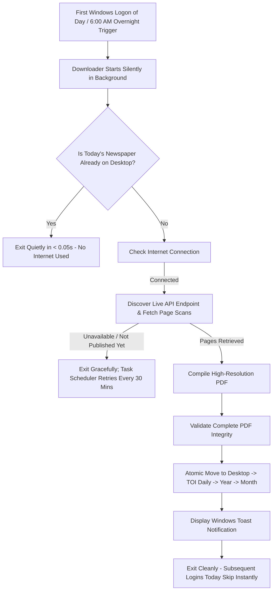

# 📰 Times of India (Ahmedabad Edition) — Daily Automatic Downloader

**A simple, 100% automatic tool that downloads today's Times of India (Ahmedabad Edition) directly to your Windows Desktop every single day.**

---

## 🌟 What This Program Does for You

* **Runs Automatically**: Every day when you turn on or open your Windows laptop, the program wakes up silently in the background.
* **Downloads Today's Paper**: Automatically fetches today's full, high-definition **Times of India — Ahmedabad Edition** from [InduPaper](https://www.indupaper.com/times-of-india.html).
* **Smart & Clean Archive**: Saves and organizes newspapers into neat **Year → Month** folders on your Desktop.
* **Instant Skip**: If today's newspaper has already been downloaded, it exits in less than 0.1 seconds without wasting your internet or battery.
* **Windows Notification**: Shows a message on your screen when your paper is ready. Simply click **"📖 Read Paper"** to open and read it!
* **1-Time Setup**: You only need to run the setup script **once**. After that, you never have to open Python, command prompts, or click anything ever again.

---

## 🚀 1-Click Installation (Do This Once)

### Step 1: Requirements
Make sure you have **Python** installed on your computer.
*(If you do not have Python, download the installer from [python.org](https://www.python.org/downloads/) and make sure to check the box that says **"Add Python to PATH"** during installation).*

### Step 2: Run the Installer
1. Open this project folder.
2. Double-click the file named **`install.bat`**.
3. A black window will appear, install the required components, create your Desktop folder, and register the automatic schedule with Windows.
4. Press any key when prompted.

**🎉 That's it! You are done.** From now on, your newspaper will download automatically every morning.

---

## 📁 Where Your Newspapers Are Stored

The application automatically creates a clean, permanent archive on your Windows Desktop:

```text
Desktop/
└── TOI Daily/
    ├── 2026/
    │   ├── August/
    │   │   ├── TOI_Ahmedabad_2026-08-27.pdf
    │   │   ├── TOI_Ahmedabad_2026-08-28.pdf
    │   │   └── ...
    │   ├── September/
    │   └── October/
    ├── 2027/
    └── 2028/
```

### Important Archive Rules:
* **Zero Desktop Clutter**: Only completed `.pdf` newspaper files are placed here. Temporary files and system logs are kept hidden away in your Windows AppData folder.
* **Permanent Collection**: Previous days' newspapers are **never** deleted or overwritten.
* **Smart Folders**: New year and month folders are created automatically as time passes.

---

## 🖱️ Manual Download Shortcut (Optional)

During installation, a shortcut named **`Download Today's TOI`** is placed on your Desktop.

* **Want to download right now?** Just double-click the **Download Today's TOI** shortcut!
* **Already downloaded?** If today's paper is already saved, clicking the shortcut will simply verify it and exit without downloading duplicates.

---

## ⏰ How Automatic Daily Execution & Retries Work
 


### Scheduling & Reliability Guarantees:
1. **First Laptop Use of the Day**: When you first log into Windows each day, the downloader activates automatically in the background.
2. **Instant Skip on Success**: If today's paper is already saved and verified, it exits silently in under 50ms without network calls or notifications. Subsequent restarts/logins that same day do nothing.
3. **Automatic 30-Minute Retries**: If the paper has not yet been published when you first log in (e.g. early morning before 6:30 AM), the background scheduler automatically retries every 30 minutes until it becomes available.
4. **Overnight Laptop Support**: If your laptop is left powered on overnight, the 6:00 AM daily trigger starts checking for the new day's edition without requiring a restart.
5. **No Fixed Cutoff**: Retries continue throughout the day until today's paper is successfully downloaded.
6. **Next Day Fresh Cycle**: When tomorrow arrives, the first login starts a fresh cycle for the new date.
7. **Optional Manual Shortcut**: You can double-click **"Download Today's TOI"** on your Desktop at any time.

---

## ⚙️ Customizing Settings (`config/config.json`)

You can customize program behavior by opening the `config/config.json` file in Notepad:

```json
{
  "edition": "Ahmedabad",
  "retry_count": 3,
  "retry_delay_seconds": 5,
  "request_timeout_seconds": 30,
  "notifications_enabled": true,
  "log_level": "INFO",
  "check_updates_weekly": true
}
```

* **`notifications_enabled`**: Set to `true` to show toast notifications when downloads finish, or `false` for complete silence.
* **`retry_count`**: How many times to retry if your internet connection drops.
* **`check_updates_weekly`**: Automatically checks for new versions of this tool once a week.

---

## 🛠️ Troubleshooting & FAQ

### 1. I turned on my laptop, but no newspaper downloaded yet.
* **Time of day**: Daily newspapers on InduPaper are typically published early in the morning (usually between 5:30 AM and 7:00 AM). If you turn on your laptop at 3:00 AM midnight, today's paper may not be available on the server yet. It will automatically download on your next login during the day!
* **Internet Connection**: If you start your laptop offline, the program waits safely and retries once you connect to Wi-Fi.

### 2. Can I manually trigger a test download?
Yes! Double-click **`run_daily.bat`** or double-click the **`Download Today's TOI`** shortcut on your Desktop.

### 3. How do I see the download logs and history?
The program maintains an internal history log. You can find your logs and permanent record here:
* **History File**: `%LOCALAPPDATA%\TOI-Daily\history.json`
* **Daily Logs**: `%LOCALAPPDATA%\TOI-Daily\logs\`
*(To open this folder, press `Win + R`, paste `%LOCALAPPDATA%\TOI-Daily` and press Enter).*

### 4. Will this download newspapers for other cities?
**No.** The program strictly enforces the **Ahmedabad** edition (`toiac`). It will never download Delhi, Mumbai, Bangalore, or any other edition.

---

## 🗑️ How to Uninstall

If you ever wish to disable the automatic daily schedule:
1. Open this project folder.
2. Double-click **`uninstall.bat`**.
3. This removes the scheduled task and desktop shortcuts.
*(Your existing downloaded newspapers in `Desktop\TOI Daily\` will remain completely untouched).*

---

## 💻 How to Run This Project on Your Own Windows PC

Follow these steps once. After installation, the program will automatically download the **Times of India — Ahmedabad Edition** every day. You do not need to run it manually every day.

### Complete Setup

1. Download this project from GitHub:
   **Code → Download ZIP**

2. Extract the ZIP file.

3. Open the extracted `TOI-Automation` folder.

4. Open **PowerShell** inside this folder.

5. Copy and run these commands **one by one**:

```powershell
# Check Python
python --version

# Install required packages
python -m pip install -r requirements.txt

# Install the browser required by the automation
python -m playwright install chromium

# Test the project
python -m pytest tests/ -v

# Install and activate the automatic daily downloader
.\install.bat
